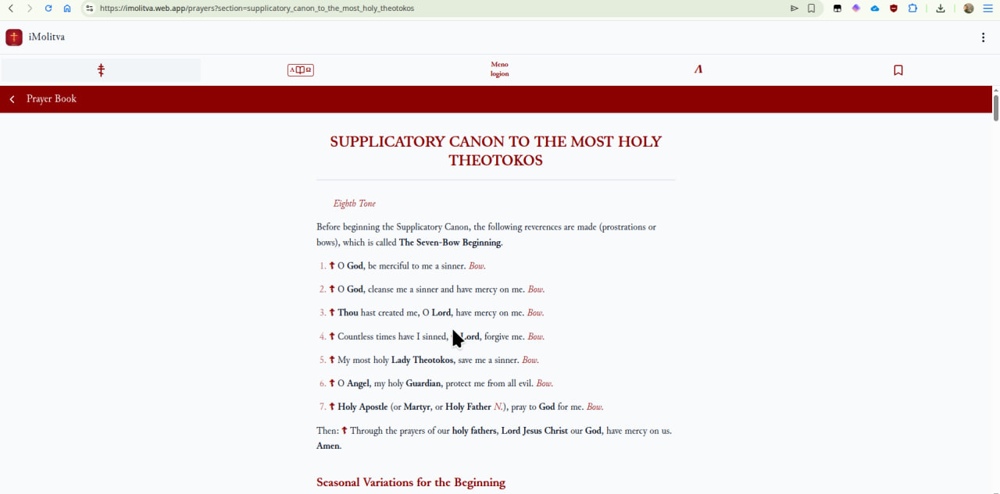
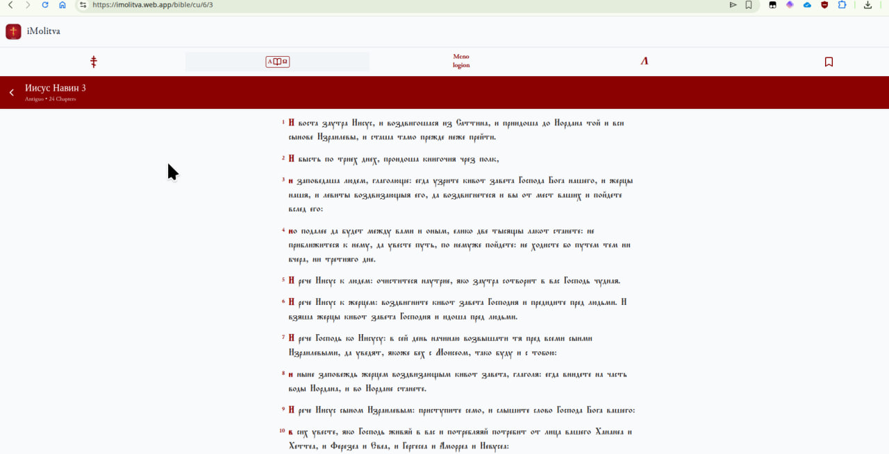
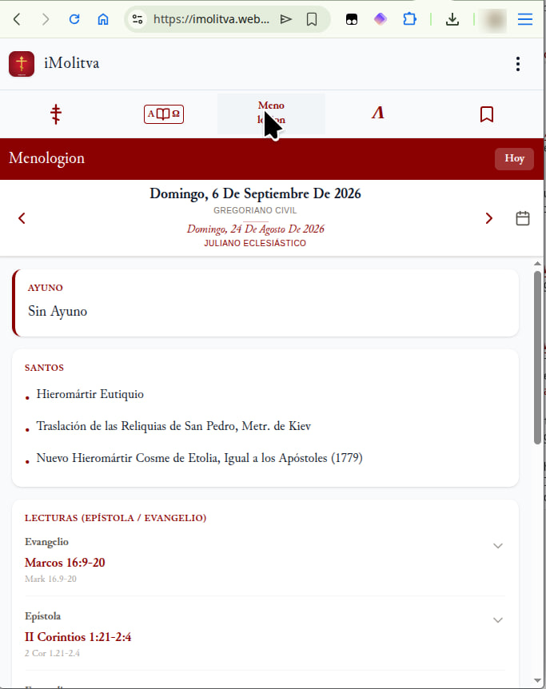

<div align="center">

# Walter García
### C++, TypeScript, JavaScript & Python Developer • Medical Interpreter

[](https://github.com/Walter-Synapse)
[](#)
[](#)

<p align="center">
  <strong>Language / Idioma:</strong><br>
  <a href="#-english-version">English</a> • <a href="#-versión-en-español">Español</a>
</p>

---

</div>

<a name="-english-version"></a>
# 🇬🇧 English Version

<div align="center">
<p align="center">
  <em>Systems-oriented software developer specializing in native low-latency tools, minimal resource consumption, and high-performance web platforms. Robust background in enterprise IT infrastructure, corporate networks, and 3+ years in high-pressure consecutive medical interpretation (OPI/VRI).</em>
</p>
</div>

## Technical Focus & Core Areas

- **Systems & Performance:** Native software engineering in C++17/C++20, cross-platform architecture (GNU/Linux and Windows API), low-latency audio pipelines, filesystem automation, and strict minimal-overhead principles (zero bloatware).
- **Web & Cloud Platforms:** Monorepo architectures built with TypeScript, native Web APIs, Vite, PWA, and Cloudflare Workers / Serverless edge computing.
- **IT Infrastructure, Servers & Networking:** End-to-end technical coordination across multi-branch enterprise environments (3 corporate locations). Deployment, configuration, and administration of Windows Server environments, Active Directory, and core infrastructure services; design and ongoing maintenance of corporate wired and wireless network topologies; hardware/software procurement, vendor liaison, and L2/L3 critical escalation support.
- **Hardware Diagnostics, Systems & Critical Support:** Deep hardware-level diagnostic and board/component repair, system recovery, cross-platform administration across GNU/Linux and Windows workstations, CRM integration, and biometric access control deployment (BioStar2, Citrix, Softland, Salesforce, RemedyForce, Zoho).
- **Medical Interpretation & Technical Terminology:** Professional consecutive interpretation (OPI & VRI) for healthcare providers and patients in high-stress, emergency, and clinical environments (LLS, Propio Language Services, LanguageLink).

---

## Projects (Selected)

### [Synapse Languages](https://synapselanguages.com/)
> Language acquisition platform driven by the scientific method of Spaced Repetition (SRS), AI tutoring, and high-fidelity audio.  
> Production URL: [synapselanguages.com](https://synapselanguages.com/) | Repository: [Walter-Synapse/Synapse](https://github.com/Walter-Synapse/Synapse)

- High-performance monorepo architecture leveraging Vite, TypeScript, Cloudflare Workers, and R2 object storage.
- Integrated phonetic transcription, neural text-to-speech pipelines, multi-modal study workflows, and reactive offline-capable PWA client.

<div align="center">
  <table>
    <tr>
      <td width="50%">
        
        <p align="center"><em>Main Dashboard & Metrics</em></p>
      </td>
      <td width="50%">
        
        <p align="center"><em>Spaced Repetition Review Flow</em></p>
      </td>
    </tr>
    <tr>
      <td width="50%">
        
        <p align="center"><em>Comprehensive Study & Practice Modes</em></p>
      </td>
      <td width="50%">
        
        <p align="center"><em>Polyglot Architecture & Engine</em></p>
      </td>
    </tr>
  </table>
</div>

### [Dictionario & Motor Morphologic Universal de Interlingua (IALA)](https://interlingua-iala.web.app/) (Open Source)
> The most comprehensive electronic dictionary and universal morphological engine ever built for Interlingua (IALA).  
> Live web application: [interlingua-iala.web.app](https://interlingua-iala.web.app/) | Repository: [Walter-Synapse/DictionarioIALA](https://github.com/Walter-Synapse/DictionarioIALA)

- Exhaustive lexicographic corpus of 51,511 entries based on the scholarship of Piet Cleij and Thomas Breinstrup, featuring 0ms instant search, POS tagging, etymology, and full alphabetical indexing.
- Computational grammar engine: automated verbal deconjugation (IALA §§94–115), classical and collateral past participles, productive prefix/derivation resolver (IALA §155), and Levenshtein distance typo suggestions.
- Real-time International Phonetic Alphabet (IPA) transcription engine implementing canonical accentuation rules (IALA §10) and cardinal number expansion up to trillions (10^18).
- Dual visual architecture: humanist classical library style (*Cinzel*, *Lora*) and pixel-perfect retro Windows 95 interface with dialog frames, Win95 menu bars, and 3D beveled surfaces. Zero dependencies (Pure Vanilla Web), 100% offline-ready.

---

### [microphone-indicator-universal](https://github.com/Walter-Synapse/microphone-indicator-universal) (Open Source)
> Lightweight C++ system utility to globally toggle microphones with instant visual HUD feedback across Windows and Linux.

- Native binaries for Windows and Linux without heavy middleware or runtime overhead.
- Engineered with strict zero-latency constraints and near-zero background CPU/RAM consumption.

---

### [Wtranslate](https://github.com/Walter-Synapse/Wtranslate) (Private)
> Low-latency translation and real-time linguistic assistant engine developed in native C++.

- Designed for high-throughput interpretation workflows, featuring International Phonetic Alphabet (IPA) processing and phoneme generation via native integration with eSpeak NG.

---

### [Sweeper](https://github.com/Walter-Synapse/Sweeper) (Private)
> Autonomous and intelligent filesystem lifecycle manager for download directories in C++17.

- Filesystem event monitoring, rule-based asset classification, and zero-friction automated pruning policies for Windows and Linux.

---

### [Kronia](https://github.com/Walter-Synapse/Kronia) (Private)
> Productivity and scheduling engine centered around calendar timeline orchestration.

---

### [iMOLITVA](https://imolitva.web.app/) (Public WebApp)
> Liturgical and devotional platform aligned with the Russian Orthodox Church tradition (ROCOR / Moscow Patriarchate), featuring an offline-first multilingual architecture.  
> Production URL: [imolitva.web.app](https://imolitva.web.app/)

- Canonical corpus of Russian Orthodox Church tradition: liturgical services, complete Psalter, prayer rule, and menologion categorized across 4 languages (Spanish, English, Italian, and Russian).
- High-performance PWA built with TypeScript and Vite featuring client-side persistence (SQLite / IndexedDB), Firebase cloud synchronization, and liturgical audio streaming powered by Cloudflare Workers and Cloudflare R2 object storage.
- Distraction-free typography and reading experience carefully calibrated for long-form contemplation, accessibility, and complete offline availability.

<div align="center">
  <table>
    <tr>
      <td width="33%">
        
        <p align="center"><em>Menologion & Calendar</em></p>
      </td>
      <td width="33%">
        
        <p align="center"><em>Church Slavonic Bible</em></p>
      </td>
      <td width="33%">
        
        <p align="center"><em>Liturgical Prayer & Canons</em></p>
      </td>
    </tr>
  </table>
</div>

---

## Technical Proficiencies

| Area | Technologies & Tools |
| :--- | :--- |
| **Languages** | C++, TypeScript, JavaScript, Bash / Shell, PowerShell, Python |
| **Systems & OS** | GNU/Linux, Windows API, Windows Server, Network Topologies, POSIX |
| **Web & Cloud** | Cloudflare Workers, Cloudflare R2, Vite, PWA, Web Audio API, Firebase / GCP |
| **IT Enterprise / CRM** | Citrix, Salesforce, RemedyForce, Zoho, BioStar2, Active Directory |
| **Spoken Languages** | Spanish (Native) • English (Advanced / Professional Medical Terminology) |

<br>
<p align="right"><a href="#walter-garcía">⬆ Back to Top / Volver Arriba</a></p>

---
---

<a name="-versión-en-español"></a>
# 🇪🇸 Versión en Español

<div align="center">
<p align="center">
  <em>Desarrollador orientado a software de sistemas nativos, herramientas de baja latencia y plataformas web de alto rendimiento. Experiencia sólida en infraestructura IT, redes corporativas y más de 3 años en interpretación médica consecutiva de alta presión (OPI/VRI).</em>
</p>
</div>

## Enfoque Técnico & Áreas de Trabajo

- **Sistemas y Rendimiento:** Desarrollo en C++17/C++20, arquitectura nativa multiplataforma (GNU/Linux y Windows API), utilidades de audio de baja latencia, automatización de sistemas de archivos y consumo mínimo de recursos (cero bloatware).
- **Web y Plataformas Cloud:** Arquitecturas monorepo con TypeScript, Web APIs nativas, Vite, PWA y Cloudflare Workers / Serverless.
- **Infraestructura IT, Servidores & Redes:** Coordinación integral de infraestructura tecnológica multisede (operaciones en 3 sucursales corporativas). Despliegue, configuración y administración de entornos Windows Server, Active Directory y servicios centrales; diseño y mantenimiento de topología de red cableada e inalámbrica corporativa; gestión de compras tecnológicas y enlace directo con proveedores de hardware/software para migraciones y soporte crítico L2/L3.
- **Diagnóstico Hardware, Sistemas & Soporte Crítico:** Diagnóstico profundo y reparación a nivel de componentes físicos, restauración de sistemas, soporte avanzado tanto en entornos GNU/Linux como Windows, integración con plataformas CRM y control de acceso biométrico (BioStar2, Citrix, Softland, Salesforce, RemedyForce, Zoho).
- **Interpretación Médica y Terminología:** Interpretación consecutiva profesional (OPI y VRI) para proveedores de salud y pacientes en entornos clínicos de emergencia (LLS, Propio Language Services, LanguageLink).

---

## Proyectos (algunos)

### [Synapse Languages](https://synapselanguages.com/)
> Plataforma de adquisición lingüística impulsada por el método científico de repetición espaciada (SRS), IA y audio de alta fidelidad.  
> Sitio en producción: [synapselanguages.com](https://synapselanguages.com/) | Repositorio: [Walter-Synapse/Synapse](https://github.com/Walter-Synapse/Synapse)

- Arquitectura de alto rendimiento en Vite y TypeScript junto a Cloudflare Workers y almacenamiento en R2.
- Soporte para transcripción fonética, síntesis de voz, múltiples modos de estudio y diseño reactivo PWA.

<div align="center">
  <table>
    <tr>
      <td width="50%">
        
        <p align="center"><em>Panel Principal & Métricas</em></p>
      </td>
      <td width="50%">
        
        <p align="center"><em>Sistema de Repetición Espaciada</em></p>
      </td>
    </tr>
    <tr>
      <td width="50%">
        
        <p align="center"><em>Modos de Aprendizaje y Práctica</em></p>
      </td>
      <td width="50%">
        
        <p align="center"><em>Arquitectura Multilingüe</em></p>
      </td>
    </tr>
  </table>
</div>

### [Dictionario & Motor Morphologic Universal de Interlingua (IALA)](https://interlingua-iala.web.app/) (Código Abierto)
> El tesauro lexicográfico y motor morfológico universal de Interlingua (IALA) más completo y potente jamás concebido.  
> Aplicación web en directo: [interlingua-iala.web.app](https://interlingua-iala.web.app/) | Repositorio: [Walter-Synapse/DictionarioIALA](https://github.com/Walter-Synapse/DictionarioIALA)

- Tesauro lexicográfico exhaustivo de 51.511 entradas basado en el trabajo de Piet Cleij y Thomas Breinstrup, con búsqueda instantánea (0ms), categorización gramatical (POS tags), etimología y navegación alfabética integral.
- Motor morfológico universal y gramática computacional: desconjugación verbal automática (IALA §§94–115), resolución de participios pasados clásicos/colaterales, desulfijación y prefijación productiva (IALA §155), y corrector por distancia Levenshtein.
- Transcripción fonética en tiempo real al Alfabeto Fonético Internacional (IPA) siguiendo las reglas canónicas de acentuación (IALA §10) y sintetizador textual/fonético de números hasta los trillones (10^18).
- Doble filosofía estética: diseño humanista clásico de biblioteca (*Cinzel*, *Lora*) y entorno retro pixel-perfect Windows 95 con menús clásicos y biselados 3D. Cero dependencias (Vanilla Web puro), 100% listo para uso offline.

---

### [microphone-indicator-universal](https://github.com/Walter-Synapse/microphone-indicator-universal) (Código Abierto)
> Utilidad de sistemas en C++ para conmutación global de micrófonos con retroalimentación visual HUD instantánea.

- Binario nativo para Windows y Linux sin capas intermedias pesadas.
- Enfoque estricto en latencia cero y consumo mínimo de CPU/RAM en segundo plano.

---

### [Wtranslate](https://github.com/Walter-Synapse/Wtranslate) (Privado)
> Motor de traducción y asistencia en tiempo real desarrollado en C++.

- Diseñado para flujos de trabajo de baja latencia con procesamiento fonético y generación de alfabeto fonético internacional (IPA) mediante integración nativa con eSpeak NG.

---

### [Sweeper](https://github.com/Walter-Synapse/Sweeper) (Privado)
> Gestor autónomo e inteligente del ciclo de vida del directorio de descargas en C++17.

- Automatización del sistema de archivos, categorización de ficheros y políticas de depuración para Windows y Linux.

---

### [Kronia](https://github.com/Walter-Synapse/Kronia) (Privado)
> Motor de productividad enfocado en la gestión y orquestación de calendarios.

---

### [iMOLITVA](https://imolitva.web.app/) (WebApp pública)
> Plataforma litúrgica y devocional de la Iglesia Ortodoxa Rusa (ROCOR / Patriarcado de Moscú) multilingüe con arquitectura offline-first.  
> Desplegada en producción: [imolitva.web.app](https://imolitva.web.app/)

- Catálogo canónico de la tradición de la Iglesia Ortodoxa Rusa: textos litúrgicos, salterio, oraciones y menologio estructurado en 4 idiomas (Español, Inglés, Italiano y Ruso).
- PWA de alto rendimiento desarrollada en TypeScript y Vite con persistencia local (SQLite / IndexedDB), sincronización en Firebase y streaming de audio litúrgico optimizado mediante Cloudflare Workers y almacenamiento de audio en Cloudflare R2.
- Experiencia de lectura tipográfica sobria diseñada para accesibilidad, navegación offline y oración libre de distracciones.

<div align="center">
  <table>
    <tr>
      <td width="33%">
        
        <p align="center"><em>Menologio & Calendario</em></p>
      </td>
      <td width="33%">
        
        <p align="center"><em>Biblia en Eslavo Eclesiástico</em></p>
      </td>
      <td width="33%">
        
        <p align="center"><em>Oraciones & Cánones Litúrgicos</em></p>
      </td>
    </tr>
  </table>
</div>

---

## Competencias Técnicas

| Área | Tecnologías / Herramientas |
| :--- | :--- |
| **Lenguajes** | C++, TypeScript, JavaScript, Bash / Shell, PowerShell, Python |
| **Sistemas & OS** | GNU/Linux, Windows API, Windows Server, Topologías de Red, POSIX |
| **Web & Cloud** | Cloudflare Workers, Cloudflare R2, Vite, PWA, Web Audio API, Firebase / GCP |
| **Sistemas IT & CRM** | Citrix, Salesforce, RemedyForce, Zoho, BioStar2, Active Directory |
| **Idiomas** | Español (Nativo) • Inglés (Avanzado / Terminología Médica Profesional) |

<br>
<p align="right"><a href="#walter-garcía">⬆ Back to Top / Volver Arriba</a></p>

---

<div align="center">

```
"The best code is the code never written. When it must exist: minimal, resilient, and fast."
```

</div>
